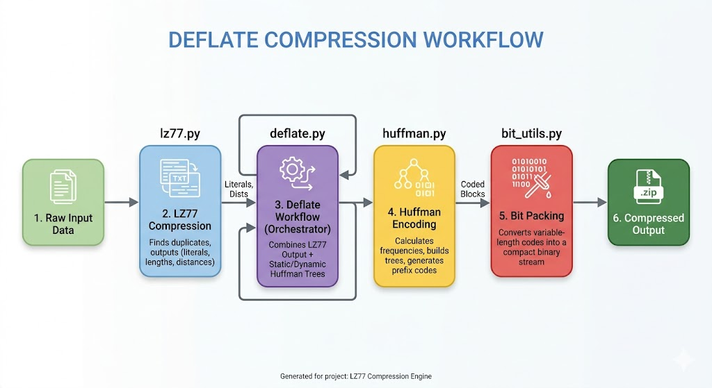
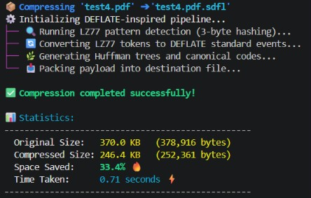
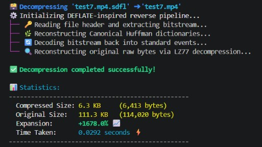

# 🗜️ Compressor-Decompressor 🗃️

## 📌 Description

This project is a bit-level file compressor and decompressor inspired by the widely-used **DEFLATE** algorithm. Built as a terminal-based CLI tool in Python, it operates directly on byte streams to achieve **byte-for-byte lossless compression**.

The compression pipeline is built from scratch and consists of four main stages:

1. **LZ77 Pattern Detection:** Finds and replaces repeated byte sequences with `(length, distance)` matches using an optimized 3-byte hash dictionary.
2. **DEFLATE Symbols Generation:** Converts literals and matches into specific symbol ranges with their respective extra bits.
3. **Canonical Huffman Coding:** Generates optimal prefix codes based on symbol frequencies to minimize payload size.
4. **Custom Bitwise Payload:** Packs the computed Huffman tables and encoded data into a custom `.sdfl` format, writing the output bit-by-bit.

---

## 👥 Contributors

This project was developed by Computer and Systems Engineering Department (CSED28++) students at **Alexandria University - Faculty of Engineering**:

* **Anas Alaa Abdo** (ID: `24010004`) - [GitHub Profile](https://github.com/AnasAlaa11)
* **Adham Hamdy Mohamed Mohamed** (ID: `24010094`) - [GitHub Profile](https://github.com/AdhamHamdy14)
* **Badr Ashraf Badry Amir** (ID: `24010134`) - [GitHub Profile](https://github.com/BadrAshraf20)
* **Omar Ayman Ahmed Abd-Elmoniem** (ID: `24010441`) - [GitHub Profile](https://github.com/OmarAyman879)
* **Amr Ahmed Mahmoud Mohamed** (ID: `24010479`) - [GitHub Profile](https://github.com/AmrAhmed292)

---

## 📁 Repository Structure

* [`main.py`](./main.py): The primary entry point of the application. It handles CLI arguments and orchestrates the overall compression and decompression workflows.
* [`lz77.py`](./lz77.py): Implementation of the LZ77 sliding window algorithm, responsible for finding duplicated strings and performing dictionary-based compression.
* [`deflate.py`](./deflate.py): The core integration layer that combines LZ77 and Huffman encoding to achieve high-efficiency compression (similar to the DEFLATE standard).
* [`huffman.py`](./huffman.py): Contains the Huffman Coding logic, including building frequency trees and generating prefix-free binary codes for data blocks.
* [`bit_utils.py`](./bit_utils.py): A utility module for low-level bit manipulation, providing functions to read and write data at the bit level rather than bytes.
* [`generate_audio.py`](./Test_scripts/generate_audio.py): A specialized script that generates synthetic, raw uncompressed media files (e.g., a `.wav` file with perfect digital silence or a flat tone). It is used to stress-test the compressor's pattern detection capabilities and demonstrate extreme compression ratios.
* [`test_script.py`](./Test_scripts/test_script.py): A diagnostic tool designed to inspect the raw binary contents of files, specifically the generated .sdfl compressed archives. It reads the file at the byte level and outputs the exact 8-bit padded binary (`0/1`) and decimal representations for each byte.

---

## ✅ Key Features

* **Smart Size Handling:** Detects and warns when compressing already packed files.
* **Robust Error Handling:** Validates file extensions and safely catches corruption during bit-stream decoding.
* **Media & Binary File Support:** Successfully compresses complex binary files (PDFs, synthetic Video/Audio) with extreme space savings (up to 94% on highly redundant data) without memory crashes.

---

## 🔄 Data Flow

The input data flows through a structured pipeline to achieve efficient compression, following the DEFLATE standard. This workflow is orchestrated by `main.py` which manages the overall data transfer between all stages.


### Pipeline Description

1. **`main.py` (The Orchestrator):** The core controller of the application. It handles I/O operations, reads the raw input file, orchestrates the sequential flow of data through all compression/decompression stages, and calculates final performance metrics.
2. **`lz77.py` (Pattern Detection):** Scans the raw byte stream using a sliding window to find repeated sequences, outputting a mix of raw literals and (distance, length) pairs.
3. **`deflate.py` (Event Formatting & Symbol Mapping):** Acts as the precise translator between LZ77 and Huffman. It maps the raw LZ77 lengths and distances to standard DEFLATE symbols and calculates the required "extra bits".
4. **`huffman.py` (Entropy Coding):** Generates optimized Canonical Huffman prefix codes for the literals and distances received from the previous stage.
5. **`bit_utils.py` (Packing):** The final stage that packs variable-length Huffman codes into a compact binary stream and writes the final `.sdfl` compressed file.

---

## 🚀 How to Run

### 1. Prerequisites

* Ensure you have Python 3 installed on your machine.
* Ensure all files are in the same directory.
* Run on any OS: The tool is cross-platform by design (Tested on Windows 11 and fully compatible with Linux and macOS).

*Note: The project strictly utilizes the Python Standard Library (e.g., `os`, `heapq`, `sys`), so no `pip install` commands are necessary!*

### 2. Usage Instructions

The tool provides a simple Command Line Interface (CLI) to manage your files. Follow these patterns to use the compressor and decompressor effectively:

#### 1️⃣ Compression

To compress a file using the DEFLATE-inspired pipeline, use the `-c` (compress) flag. This will generate a `.sdfl` file in the same directory.

**Command:**

```bash
python main.py -c .\tests\test4.pdf
```

**Result:**

* A compressed file named `test4.pdf.sdfl` is generated in the same directory.
* Real-time statistics (original size, compressed size, and savings %) are displayed.

#### 2️⃣ Decompression

To restore a `.sdfl` file to its original state, use the `-d` (decompress) flag.

**Command:**

```bash
python main.py -d .\tests\test4.pdf.sdfl
```

**Result:**

* The original file is reconstructed with its initial content and name.
* The tool automatically handles extension validation before processing.

---

## 🧪 How to use test scripts

* ### generate_audio.py

```bash
python ./Test_scripts/generate_audio.py
```

* ### test_script.py

```bash
python ./Test_scripts/test_script.py
```

---

## 🧠 How it Works (The Math behind the Magic)

Our compression engine relies on a powerful two-step combination of dictionary-based string matching and statistical entropy coding, firmly rooted in **Information Theory**.

### 1. LZ77 (Spatial Redundancy Elimination)

LZ77 utilizes a sliding window approach divided into a **Search Buffer** (history) and a **Lookahead Buffer** (upcoming data). Instead of storing repetitive byte sequences, the algorithm encodes them as a reference tuple: `<Distance, Length>`.

For instance, if the sequence "CSED" appeared 20 bytes ago and is 4 bytes long, it is encoded simply as `<20, 4>`. This transforms spatial redundancy into highly compact pointers.

### 2. Huffman Coding (Entropy Optimization)

According to Claude Shannon's Source Coding Theorem, the theoretical lower bound for the average length of a compressed symbol is defined by its Entropy $H(X)$:

$$H(X) = -\sum_{i=1}^{n} P(x_i) \log_2 P(x_i)$$

Where $P(x_i)$ is the probability (or frequency) of symbol $x_i$ appearing in the data stream.

To approach this optimal limit, we use **Canonical Huffman Coding**. It builds a binary tree prioritizing higher-frequency symbols. Frequent symbols are assigned shorter bit sequences (e.g., `01`), while rare symbols receive longer ones (e.g., `11010`). Because the generated binary codes are **Prefix-Free** (no code is a prefix of any other), the continuous bit-stream can be unambiguously decoded without needing separators.

---

## 💻 Example Output

Here is a glimpse of what the terminal output looks like during a successful execution cycle:

### Compression Cycle



### Decompression Cycle



---

## 🪪 License

This project was developed for educational purposes as part of the curriculum at Alexandria University, Faculty of Engineering. All rights reserved by the authors.
